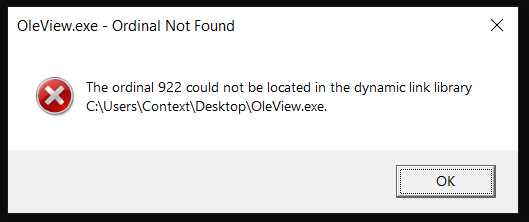
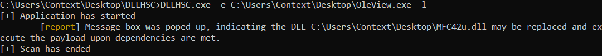
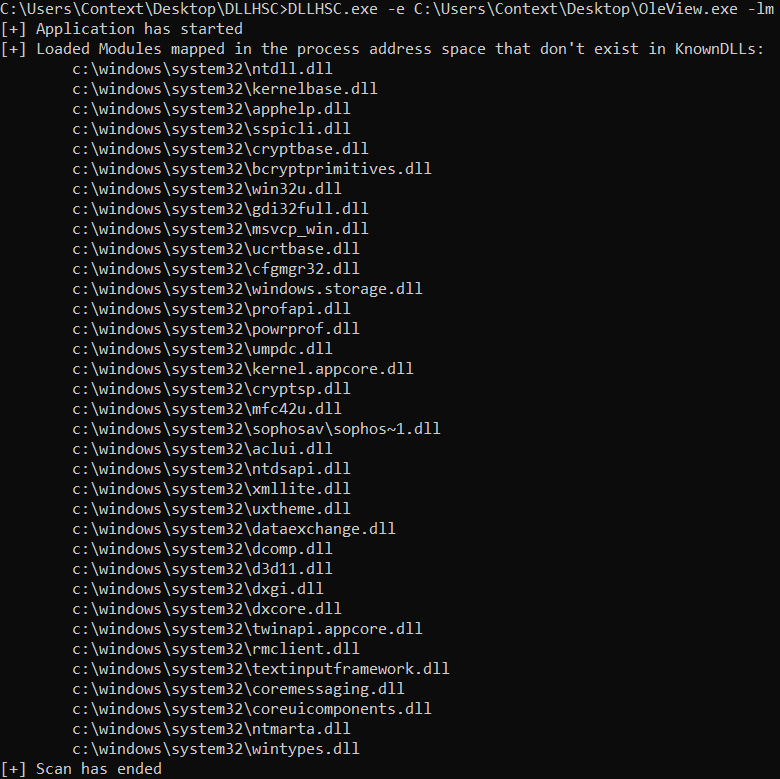
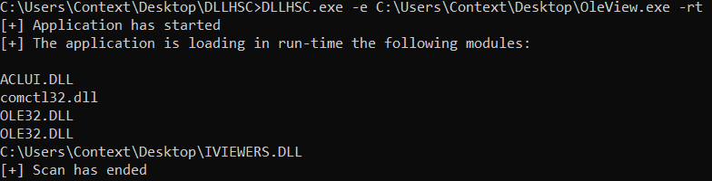

# DLLHSC

DLL Hijack SCanner - A tool to generate leads and automate the discovery of candidates for DLL Search Order Hijacking 

## Index of this page

- [Contents of this repository](#contents-of-this-repository)
- [Modes of operation](#modes-of-operation)
- [Compile and Run Guidance](#compile-and-run-guidance)
- [Help menu](#help-menu)
- [Example Runs](#example-runs)
- [Feedback](#feedback)

## Contents of this repository

This repository hosts the Visual Studio project file for the tool (DLLHSC), the project file for the API hooking functionality (detour), the project file for the payload and last but not least the compiled executables for x86 and x64 architecture (in the release section of this repo). The code was written and compiled with **Visual Studio Community 2019**.

If you choose to compile the tool from source, you will need to compile the projects DLLHSC, detour and payload. The DLLHSC implements the core functionality of this tool. The detour project generates a DLL that is used to hook APIs. And the payload project generates the DLL that is used as a proof of concept to check if the tested executable can load it via search order hijacking. The generated payload has to be placed in the same directory with DLLHSC and detour named *payload32.dll* for x86 and *payload64.dll* for x64 architecture.

## Modes of operation

The tool implements 3 modes of operation which are explained below.

### Lightweight Mode

Loads the executable image in memory, parses the Import table and then
replaces any DLL referred in the Import table with a payload DLL.

The tool places in the application directory only a module (DLL) the is
not present in the application directory, does not belong to WinSxS and
does not belong to the KnownDLLs.

The payload DLL upon execution, creates a file in the following path:
`C:\Users\%USERNAME%\AppData\Local\Temp\DLLHSC.tmp` as a proof of
execution. The tool launches the application and reports if the payload
DLL was executed by checking if the temporary file exists. As some
executables import functions from the DLLs they load, error message
boxes may be shown up when the provided DLL fails to export these
functions and thus meet the dependencies of the provided image. However,
the message boxes indicate the DLL may be a good candidate for payload
execution if the dependencies are met. In this case, additional analysis
is required. The title of these message boxes may contain the strings:
`Ordinal Not Found` or `Entry Point Not Found`. DLLHSC looks for windows
that contain these strings, closes them as soon as they shown up and
reports the results.

### List Modules Mode

Creates a process with the provided executable image, enumerates the
modules that are loaded in the address space of this process and reports
the results after applying filters.

The tool only reports the modules loaded from the System directory and do
not belong to the KnownDLLs. The results are leads that require additional
analysis. The analyst can then place the reported modules in the application
directory and check if the application loads the provided module instead.

### Run-Time Mode

Hooks the LoadLibrary and LoadLibraryEx APIs via [Microsoft
Detours](https://github.com/microsoft/Detours) and reports the modules
that are loaded in run-time.

Each time the scanned application calls LoadLibrary and LoadLibraryEx,
the tool intercepts the call and writes the requested module in the file
`C:\Users\%USERNAME%\AppData\Local\Temp\DLLHSCRTLOG.tmp`. If the
LoadLibraryEx is specifically called with the flag
LOAD_LIBRARY_SEARCH_SYSTEM32, no output is written to the file. After
all interceptions have finished, the tool reads the file and prints the
results. Of interest for further analysis are modules that do not exist
in the KnownDLLs registry key, modules that do not exist in the System
directory and modules with no full path (for these modules loader
applies the normal search order).

## Compile and Run Guidance

Should you choose to compile the tool from source it is recommended to do so on Visual Code Studio 2019. In order the tool to function properly, the projects *DLLHSC*, *detour* and *payload* have to be compiled for the same architecture and then placed in the same directory. Please note that the DLL generated from the project *payload* has to be renamed to *payload32.dll* for 32-bit architecture or *payload64.dll* for 64-bit architecture. 

## Help menu

The help menu for this application

```
NAME
        dllhsc - DLL Hijack SCanner

SYNOPSIS
        dllhsc.exe -h

        dllhsc.exe -e <executable image path> (-l|-lm|-rt) [-t seconds]

DESCRIPTION
        DLLHSC scans a given executable image for DLL Hijacking and reports the results

        It requires elevated privileges

OPTIONS
        -h, --help
                display this help menu and exit

        -e, --executable-image
                executable image to scan

        -l, --lightweight
                parse the import table, attempt to launch a payload and report the results

        -lm, --list-modules
                list loaded modules that do not exist in the application's directory

        -rt, --runtime-load
                display modules loaded in run-time by hooking LoadLibrary and LoadLibraryEx APIs

        -t, --timeout
                number of seconds to wait for checking any popup error windows - defaults to 10 seconds

```

## Example Runs

This section provides examples on how you can run DLLHSC and the results it reports. For this purpose, the legitimate Microsoft utility *OleView.exe* (MD5: D1E6767900C85535F300E08D76AAC9AB) was used. For better results, it is recommended that the provided executable image is scanned within its installation directory.

The flag `-l` parses the import table of the provided executable, applies filters and attempts to weaponize the imported modules by placing a payload DLL in the application's current directory. The scanned executable may pop an error box when dependencies for the payload DLL (exported functions) are not met. In this case, an error message box is poped. DLLHSC by default checks for 10 seconds if a message box was opened or for as many seconds as specified by the user with the flag `-t`. An error message box indicates that if dependencies are met, the module can be weaponized.

The following screenshot shows the error message box generated when `OleView.dll` loads the payload DLL :



The tool waits for a maximum timeframe of 10 seconds or `-t` seconds to make sure the process initialization has finished and any message box has been generated. It then detects the message box, closes it and reports the result:



The flag `-lm` launches the provided executable and prints the modules it loads that do not belong in the KnownDLLs list neither are WinSxS dependencies. This mode is aimed to give an idea of DLLs that may be used as payload and it only exists to generate leads for the analyst.



The flag `-rt` prints the modules the provided executable image loads in its address space when launched as a process. This is achieved by hooking the *LoadLibrary* and *LoadLibraryEx* APIs via Microsoft Detours.



## Feedback

For any feedback on this tool, please use the GitHub Issues section.
